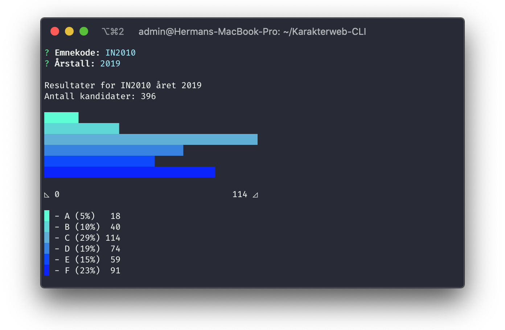

# [Karakterweb](https://karakterweb.no)-CLI

CLI for grade statistics at norwegian universities

## Installation

Try it out without installing locally using npx:\
`npx karakter`\
\
Or install it globally:\
 `npm i -g karakter`

## Usage

Just type `karakter` in your shell (if installed globally), the program will prompt you for input

The default university is UiO. You can change this default by running with the `--set-uni` option once:\
`karakter --set-uni=ntnu`

Universities currently supported:

- uio
- ntnu
- uib

Open a pull request/issue or contact if you want an institution added

## Data

Data from [NSD](https://nsd.no)\
[API license](https://data.norge.no/nlod/no/2.0)

